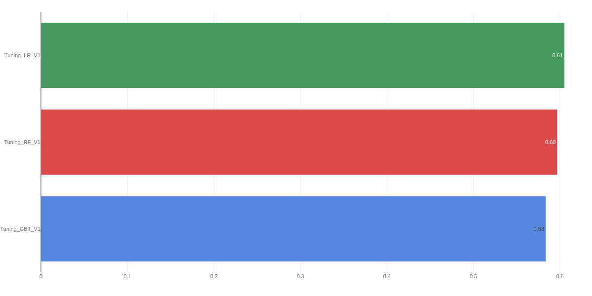

# 📉 End-to-End Churn Prediction com Databricks & PySpark

## 🎯 Motivação Técnica
Este projeto foi desenvolvido com o intuito de simular um fluxo de trabalho real de **Big Data** e **MLOps**. O objetivo principal foi ir além do Pandas/Scikit-Learn tradicional e consolidar a proficiência em:

* **Processamento Distribuído:** Manipulação de grandes volumes de dados com **PySpark**.
* **Ecossistema Cloud:** Utilização do **Databricks** como plataforma unificada de dados.
* **Ciclo de Vida de Modelos:** Implementação de rastreamento de experimentos profissional com **MLflow**.


## 💼 Visão Geral do Negócio
A rotatividade de clientes (Churn) é um dos maiores desafios para empresas de serviços recorrentes. O custo de adquirir um novo cliente pode ser até **5 a 25 vezes maior** do que reter um existente.

O objetivo deste projeto é desenvolver um pipeline de Machine Learning escalável utilizando o ecossistema **Databricks** para prever quais clientes têm maior probabilidade de cancelar o serviço. Isso permite que a equipe de marketing tome ações preventivas direcionadas, aumentando a retenção e o *Life Time Value* (LTV).

## 🛠️ Stack Tecnológica
Este projeto simula um ambiente de Big Data moderno:

* **Linguagem:** Python
* **Processamento Distribuído:** PySpark (Spark SQL & MLlib)
* **Ambiente de Desenvolvimento:** Databricks Free Edition
* **Experiment Tracking & Registry:** MLflow
* **Armazenamento:** Databricks

## 🚀 Arquitetura do Projeto

O projeto segue o fluxo padrão de ciência de dados (CRISP-DM) adaptado para Big Data:

1.  **Ingestão de Dados:** Aquisição dos dados brutos disponiveis no [kaggle](https://www.kaggle.com/datasets/olistbr/brazilian-ecommerce/data) (CSV) para o Data Lake.
2.  **Feature Engineering** Processamento do dado bruto, em uma estrutura do tipo medallion. Bronze: Dado Bruto, Silver: Dado limpo e Agrupado, Gold: Pronto para a utilização
3.  **Análise Exploratória (EDA):** Análise estatística e identificação de correlações usando PySpark e Pandas (para visualização).
4.  **Modelagem (Machine Learning):** Treinamento de modelos classificadores (Logistic Regression, Random Forest, GBT).
      * Utilização de peso para lidar com classes desbalanceadas
5.  **MLOps (MLflow):** Log de parâmetros, métricas e artefatos de modelo para comparação de experimentos.

## 📊 Resultados e Métricas

O melhor modelo selecionado foi a **Regressão Logistica**, obtendo os seguintes resultados no conjunto de teste:

| Métrica | Valor | Descrição | Interpretação |
| :--- | :--- | :--- | :--- |
| **AUC-ROC** | **0.605** | Capacidade de distinção entre classes. | Baixa distinção entre as classes |

> **Nota Técnica:** O foco atual do projeto reside na construção da **arquitetura de dados robusta e reprodutível**. As métricas indicam a necessidade de inclusão de novas features exógenas ou aplicação de outros modelos nas próximas iterações para superar este baseline.





## 📂 Estrutura do Repositório

```text
├── notebooks/                            # Notebooks do Databricks
│   ├── 000_setup.ipynb                   # Download dos Dados e configuração das tabelas
│   ├── 001_etl.ipynb                     # limpeza e extração dos features
│   ├── 002_eda.ipynb                     # Análise Exploratória dos dados
│   ├── 003_train.ipynb                   # Treinamento e Registro no MLflow de modelos default
│   ├── 004_tune.ipynb                    # Rotina para otimização de hiperparametros - Hyperparameter Tuning (Hyperopt)
|   └── 005_batch_inference.ipynb         # Utilização do modelo para processamento
├── src/                                  # Códigos reutilizaveis do projeto
|   ├── domain/                           # Dominios
│   |   └── feature_engineering.py        # Responsável pela extração dos features
|   ├── infrastructure/             
│   |   ├── data_manager.py               # Responsável por comunicar com o Data Lake
│   |   └── ml_trainer.py                 # Responsável por treinar modelos do MLlib Apache Spark
|   ├── utility/             
│   |   └── environment.py                # Utilitario para as variaveis de ambiente do projeto
├── .env.template/                        # Template para a criação do .env do projeto
├── README.md                             # Documentação do projeto
└── requirements.txt                      # Dependências utilizadas no projeto
```

## 👣 Como Executar

1. Clone este repositório para o seu Workspace no Databricks.

2. Crie o ```.env``` a partir do template e configure as variaveis do ambiente.

3. Execute os notebooks em ordem:

    1. Iniciando pelo ```000_setup.ipynb```
    2. Seguindo para ```001_etl.ipynb```
    3. ...

## 🧠 Lições Aprendidas

- **Manipulação de Big Data**: Utilização de PySpark para processar dados que não caberiam na memória de uma máquina local.

- **Ciclo de Vida de ML**: Importância do MLflow para rastrear dezenas de experimentos e garantir reprodutibilidade.

- **Dados Desbalanceados**: Utilização de pesos para treinamento e análise de métricas como F1-Score e ROC AUC.

## Autor
Arthur Gabriel Capati

[LinkedIn](https://www.linkedin.com/in/arthur-gabriel-capati/)

[GitHub](https://github.com/arthurcapati)